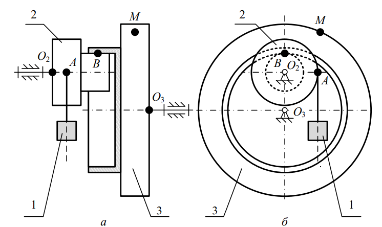
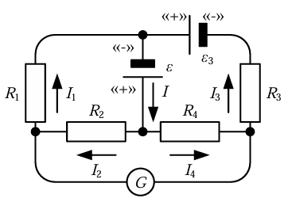

# Программы КСЕ команды Fractal
В рамках дисциплины "Концепция Современного Естествознания" командам нужно решать задачи сначала "традиционным" способом, вводя формулы в файле .docx, потом писать программы, которые это частично автоматизируют.

Это наши реализации этих программ. Всё написано на языке Java с библиотекой JavaFX.

## Задание 2, 3. Кинематика + Динамика

### Условия заданий

2) Механизм&#160;(рис.&#160;2.1) состоит из двух блоков 2 и&#160;3, каждый из которых образован совокупностью жестко связанных большого и малого цилиндров. Малый цилиндр&#160;2 взаимодействует (без&#160;скольжения) с малым цилиндром&#160;3 в точке&#160;B. Большой цилиндр&#160;2 НЕ взаимодействует с большим цилиндром&#160;3. К большому цилиндру&#160;2 в точке&#160;A на «нерастяжимом тросе» подвешен груз&#160;1, который совершает «прямолинейное движение» по заданному уравнению. Определить «путь», пройденный грузом&#160;1, а так&#160;же «скорость», «нормальное», «тангенциальное» и «полное ускорение» точки&#160;M большого цилиндра блока&#160;3 механизма в момент времени&#160;t.

3) Механизм, описание структуры которого представлено в задаче части №&#160;2 задания №&#160;2 является идеальным (рис.&#160;3.3). Определить силу, которую необходимо приложить к грузу&#160;1 для прекращения движения в момент времени&#160;t, а также силу, которая сформируется при продолжении движения груза&#160;1 в момент времени t в точке М большого цилиндра блока&#160;3 механизма. Радиусы цилиндров блоков 2 и 3, а также необходимые кинематические параметры взять из решения задачи задания №&#160;2.

По условиям задачи 3, нужно сделать модификацию программы для 2 задачи, но здесь пришлось дописывать 2-ю с нуля :) сейчас в итоге это просто как одна программа. При включённом чекбоксе решается третья.

## Задание 4.

мне лень сюда прямо сейчас писать суть задачи.

### Концепция программы

#### 1) Назначение программы:
Программа предназначена для автоматизированного расчёта сил тока и моментов, действующих на элементы механизма, описанного в задании, а также для визуализации результатов.

#### 2) Исходные данные (константы, заданные в программе)
- Сопротивление резисторов:
  - R2 = 5 (Ом)
  - R3 = 6 (Ом)
  - R4 = 7 (Ом)
- Ток в ветви с гальванометром: - I_g = 0 (А) (отсутствует)
- Электродвижущая сила на ветви CB (ε3): 11 (В)

#### 3) Выходные данные (6 параметров)
- Сопротивление резистора R1 (Ом)
- Силы тока (А):
  - I_1 в ветви AB
  - I_2 в ветви DA
  - I_3 в ветви CB
  - I_4 в ветви DC
  - I в цепи BD
- Напряжения (В):
  - U_ab в ветви AB
  - U_da в ветви DA
  - U_cd в ветви CD

#### 5.) Алгоритм решения

(По пути традиционного решения)
1. Расчёт силы тока в ветви CB (I_3) = ветви DC (I_4)
2. Расчёт силы тока в ветви DA (I_2) = ветви AB (I_1) 
3. Расчёт силы тока в ветви BD (I)
4. Проведение автоматической проверки на валидность I_4, через I и I_2 
5. Расчёт сопротивления резистора R_1 в ветви AB через две формулы.
6. Проведение автоматической проверки на равенство R_1 в пункте 5
7. Расчёт напряжения в ветвях без ЭДС: AB, CD, DA.
8. Проведение автоматической проверки на валидность данных. (Формула 4.11)

#### 6.) Архитектура программы
Программа реализована на Java и является графическим приложением (JavaFX).

Структура программы включает:
- Константы (+ их вывод на экран)
- Метод расчёта параметров
- Главное окно:
  - Начальные значения
  - Поле ввода электродвижущей силы
  - Текст задания
  - Схема электрической цепи
  - Кнопка для начала расчётов
- Окно вывода результата
  - Список всех значений в результате
  - Кнопка экспорта значений в формате .JSON
  - Возможность расширить список значений с помощью всех используемых переменных, чтобы тчательней следить за расчётами.

#### 7) Пример использования

- Запуск программы (покажется основное окно)
- Ознакомление с условиями задачи
- Ввод значения для электродвижущей силы (ε)
- Нажатие на кнопку "Рассчитать" (откроется окно с результатами)
- Ознакомление с результатами
- По желанию можно ознакомиться с переменными, которые использовались при вычислении, нажав на Чекбокс "Показать переменные, используемые при счёте"
- Экспортировать данные с помощью кнопки "Экспорт в .json"
- Через системное окно выбора конечного файла выбрать место, когда загрузится результат программы. Программа сохранит все данные, которые показаны в результате.

### Системные требования (для доков):
- ОС: Windows 10+, Linux, macOS
- Процессор: x86-64 (Intel Core 2 Duo+) / любой arm64 
- ОЗУ: 300 Мб
- Дисковое пространство: 150 Мб (с учётом JRE)
- Видеокарта: любая с поддержкой 2D графики
- Разрешение: 1024x768+
- Язык: Java 17
- Среда реализации: Intelij IDEA Community Edition 2026.1.1